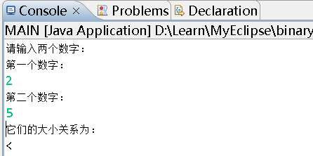

# 
 第2章 JAV语言基础
## 一、课后作业 
### 1、文件组织
&emsp;&emsp;下图为MyEclipse的Package Explorer：
     
&emsp;&emsp;在JAVA Project ch2中，我新建了一个homework包，其中有一个主类Main用来测试其他类中的方法和函数，另外还有两个类Math和Month用来实现题目要求功能。
###2、题目实现
####（1）输入一个月份，然后输出对应的月份有多少天(不考虑闰年)，将天数输出。
&emsp;&emsp;以下为Month类中monthData方法的代码：

    /**
     * 
     */
    package homework;
    
    /**
     * @author forest
     *
     */
    public class Month 
    {
    
    	/**
    	 * 
    	 */
    	public static short monthDate(short month) 
    	{
    		short month_arry[] = {31, 28, 31, 30, 31, 30, 31, 31, 30, 31, 30, 31};
    		
    		return month_arry[month-1];
    	}
    }
&emsp;&emsp;以下为主类中测试代码：  

    /**
     * 
     */
    package homework;
    
    import java.io.IOException;
    import java.util.Scanner;
    
    /**
     * @author forest
     *
     */
    public class Main 
    {
    	/**
    	 * @param args
    	 * @throws IOException 
    	 */
    	public static void main(String[] args) throws IOException 
    	{
    		// TODO Auto-generated method stub
    		while (true) 
    		{
    			short month = 0;
    			@SuppressWarnings("resource")
    			Scanner input = new Scanner(System.in);
    			System.out.println("请输入当前月份：");
    			month = input.nextShort();
    			System.out.println(Month.monthDate(month));
    		}
    	}
    }
&emsp;&emsp;本题采用数组存放了12个月的天数，通过查找的方式找到每个月的天数。
&emsp;&emsp;以下为题目的实验结果：
   

####（2）使用字符串条件判断，输入两个数字和加、减、乘、除操作，执行两个数字对应操作，并输入结果。
&emsp;&emsp;以下分别为功能代码和测试代码：  

    /**
     * 
     */
    package homework;
    
    /**
     * @author forest
     *
     */
    public class Math 
    {	
    	public static int dealAnswer(String arr) 
    	{
    		int answer = 0;
    		int a = 0, b = 0;
    		
    		a = (int)arr.codePointAt(0);
    		b = (int)arr.codePointAt(2);
    		
    		switch (arr.charAt(1)) 
    		{
    		case '+': 
    			answer = (a - 48) + (b - 48);
    			break;
    		case '-': 
    			answer = (a - 48) - (b - 48);
    			break;
    		case '*': 
    			answer = (a - 48) * (b - 48);
    			break;
    		case '/': 
    			answer = (a - 48) / (b - 48);
    			break;
    		default:
    			answer = (a - 48) + (b - 48);
    			break;
    		}
    		
    		return answer;
    	}
    /**
     * 
     */
    package homework;
    
    import java.io.IOException;
    import java.util.Scanner;
    
    /**
     * @author forest
     *
     */
    public class Main 
    {
    	/**
    	 * @param args
    	 * @throws IOException 
    	 */
    	public static void main(String[] args) throws IOException 
    	{
    		// TODO Auto-generated method stub
    		while (true) 
    		{			
    			String arr = "";
    			int answer = 0;			
    			System.out.println("请输入表达式：");
    		    @SuppressWarnings("resource")
    			Scanner input = new Scanner(System.in);
    		    arr = input.nextLine();
    			answer = Math.dealAnswer(arr);		
    			System.out.println(answer);
    		}
    	}
    }
&emsp;&emsp;实验中主要运用了方法arr.codePointAt()，该方法的作用是，定位对应字符串arr中某一下标的ASCALL码值。从而可以从输入的计算字符串中获取字符来判断四则运算的方式。
&emsp;&emsp;以下为题目的实验结果：
  
####（3）输出两个整数，打印出他们的大小关系，是小于、大于还是等于。
&emsp;&emsp;以下分别为功能代码和测试代码：  

    /**
     * 
     */
    package homework;
    
    /**
     * @author forest
     *
     */
    public class Compare 
    {
    	public static char compareNum(int a, int b) 
    	{
    		char operator = '#';
    		
    		if(a == b)
    		{
    			operator = '=';
    		}
    		else if (a > b) 
    		{
    			operator = '>';
    		}		
    		else if (a < b) 
    		{
    			operator = '<';
    		}
    		return operator;
    	}
    }
    /**
     * 
     */
    package homework;
    
    import java.io.IOException;
    import java.util.Scanner;
    
    /**
     * @author forest
     *
     */
    public class Main 
    {
    	/**
    	 * @param args
    	 * @throws IOException 
    	 */
    	public static void main(String[] args) throws IOException 
    	{
    		// TODO Auto-generated method stub
    		while (true) 
    		{			
    			int a = 0,b = 0;
    			char operator = '#';
     			System.out.println("请输入两个数字：");
    			System.out.println("第一个数字：");
    		@SuppressWarnings("resource")
    			Scanner input = new Scanner(System.in);
    		a = input.nextInt();
    			System.out.println("第二个数字：");
    		b = input.nextInt();
    		System.out.println("它们的大小关系为：");
    		operator = Compare.compareNum(a, b);
    		System.out.println(operator);
    		}
    	}
    }
&emsp;&emsp;以下为题目的实验结果：
  
####（4）JAVA阶乘求和1！+2！+...+10！。
&emsp;&emsp;以下分别为功能代码和测试代码：  

    /**
     * 
     */
    package homework;
    
    /**
     * @author forest
     *
     */
    public class Math 
    {	
    	public static int factorialCal(int num) 
    	{
    		int answer = 0;
    		int sum = 1;
    		for (int j = 1; j < num + 1; j ++) 
    		{
    			for(int i = j; i > 0; i --)
    			{
    				sum = sum * i;
    			}
    			answer = answer + sum;
    			sum = 1;
    		}
    		return answer;
    	}
    }
    /**
     * 
     */
    package homework;
    
    import java.io.IOException;
    import java.util.Scanner;
    
    /**
     * @author forest
     *
     */
    public class Main 
    {
    	/**
    	 * @param args
    	 * @throws IOException 
    	 */
    	public static void main(String[] args) throws IOException 
    	{
    		// TODO Auto-generated method stub
    		while (true) 
    		{			
    			int answer = 0;
    		System.out.println("阶乘之和为为：");
    			answer = Math.factorialCal(10);
    			System.out.println(answer);
    		}
    	}
    }
&emsp;&emsp;以下为题目的实验结果：
  
# 
 第3章 类的封装、继承和多态
##一.3.1
###1.类
- 成员方法重载：一个类中有同名的成员方法，参数列表不同。重载的多种方法为一种功能提供多种实现。重载方法之间必须以不同的参数列表（数据类型，参数个数，**参数次序**（相同的数据类型和参数个数次序不同也重载））来区别。
如：   

    void set(int y, int m, int d);
    void set(int m, int d);
    void set(int d);
    void set(MyDate date);  
   
###2.对象   
- 声明对象：不会声明对象空间，只会分配引用变量的空间。
  实例化对象：分配了实例化对象的空间，new关键词的作用是调用相应类中的构造方法，构造方法即构造了一块实例化对象的空间。  
  相关介绍文章链接：[https://blog.csdn.net/bestcxx/article/details/49635111](https://blog.csdn.net/bestcxx/article/details/49635111 "声明对象和实例化对象的区别")（有比喻介绍）。  
- JAVA的引用类型：

    package ch3$1;   

    public class MyDate
    {
    	int year, month, day;
    	void set(int y, int m, int d)
    	{
    		year = y;
    		month = m;
    		day = d;
    	}
    }
    
    MyDate d1;
